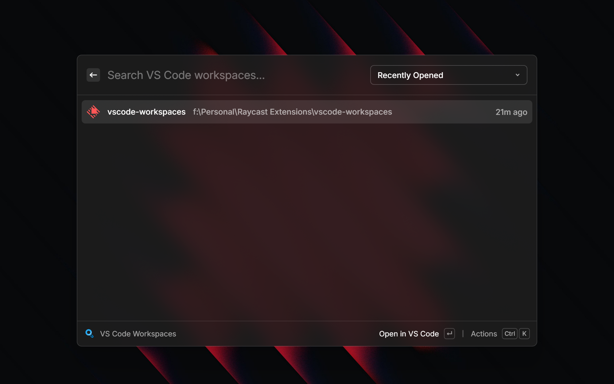

# VS Code Workspaces for Raycast

Quickly browse, open, and manage your VS Code workspaces directly from Raycast.



## Features

### 🚀 Quick Access
- **Instant Search**: Find your workspaces with blazing-fast search
- **Smart Icons**: Automatic project type detection with matching icons (React, Vue, Python, Go, and more)
- **Recently Opened**: See when you last opened each workspace
- **Multiple Sort Options**: Sort alphabetically, by recent activity, favorites first, or project type

### ⭐ Favorites & Organization
- **Pin Workspaces**: Mark frequently-used workspaces as favorites (`⌘F`)
- **Favorites First**: Keep your most important projects at the top
- **Time Tracking**: See when you last opened each workspace ("2h ago", "3d ago")

### 💪 Powerful Actions
- **Open in VS Code**: Launch workspace instantly (`↵`)
- **Toggle Favorites**: Pin/unpin workspaces (`⌘R`)
- **Open in Terminal**: Jump directly to workspace in your terminal (`⌘⇧T`)
- **Reveal in Finder/Explorer**: Open workspace folder in file explorer (`⌘⇧R`)
- **Copy Path**: Quick clipboard access (`⌘⇧C`)
- **Copy Name**: Copy workspace name (`⌘⇧C`)
- **Delete Workspace**: Remove from VS Code history (`⌘⌫`)

### 🎯 Smart Features
- **Cross-Platform**: Works on macOS and Windows
- **Multi-Editor Support**: Detects VS Code, VS Code Insiders, VSCodium, and Cursor
- **Project Detection**: Automatic recognition of 20+ project types and frameworks
- **Safe Deletion**: Workspaces moved to system trash, not permanently deleted

## Supported Project Types

The extension automatically detects and displays appropriate icons for:

**JavaScript/TypeScript:**
- Raycast Extensions
- Next.js
- React
- Vue / Nuxt
- Angular
- Svelte
- Node.js

**Backend Frameworks:**
- Django
- Flask
- FastAPI
- Spring
- Ruby on Rails

**Languages:**
- Python
- Go
- Rust
- Java
- Kotlin
- Ruby
- PHP
- C#
- Swift
- Dart / Flutter
- Elixir
- Scala
- Haskell

## Installation

Install from the [Raycast Store](https://raycast.com/yugveer_wadzatia/vscode-workspaces) or build from source:

```bash
git clone https://github.com/yugveer06/vscode-workspace-finder.git
cd vscode-workspace-finder
npm install
npm run dev
```

## Usage

1. Open Raycast (`⌘Space` or your configured hotkey)
2. Type "VS Code Workspaces" or set up a custom alias
3. Search for your workspace
4. Press `↵` to open or browse available actions

### Keyboard Shortcuts

| Action | Shortcut |
|--------|----------|
| Open in VS Code | `↵` |
| Toggle Favorite | `⌘R` |
| Open in Terminal | `⌘⇧T` |
| Reveal in Finder/Explorer | `⌘⇧R` |
| Copy Path | `⌘⇧C` |
| Copy Name | `⌘⇧C` |
| Delete Workspace | `⌘⌫` |

## Requirements

- **VS Code**: The extension reads workspace history from VS Code's storage
- **macOS or Windows**: Cross-platform support
- **Optional**: Git for branch information display

## How It Works

The extension reads VS Code's workspace storage from:
- **macOS**: `~/Library/Application Support/Code/User/workspaceStorage`
- **Windows**: `%APPDATA%\Code\User\workspaceStorage`

It also supports VS Code Insiders and VSCodium variants.

## Privacy

All data is stored locally on your machine using Raycast's LocalStorage API. Your workspace data never leaves your computer.

## Contributing

Contributions are welcome! Please feel free to submit a Pull Request.

## License

MIT License - see LICENSE file for details

## Credits

Built by [Yugveer Wadzatia](https://github.com/yugveer06)

Icons provided by [Devicon](https://devicon.dev)
